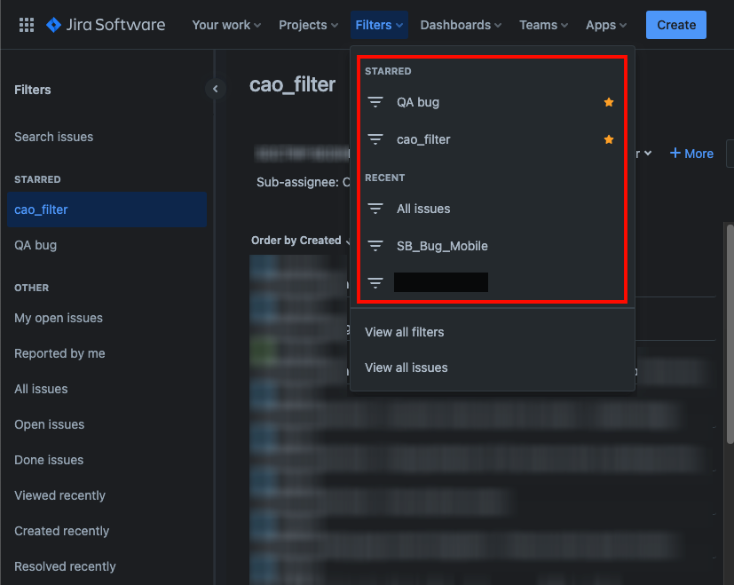
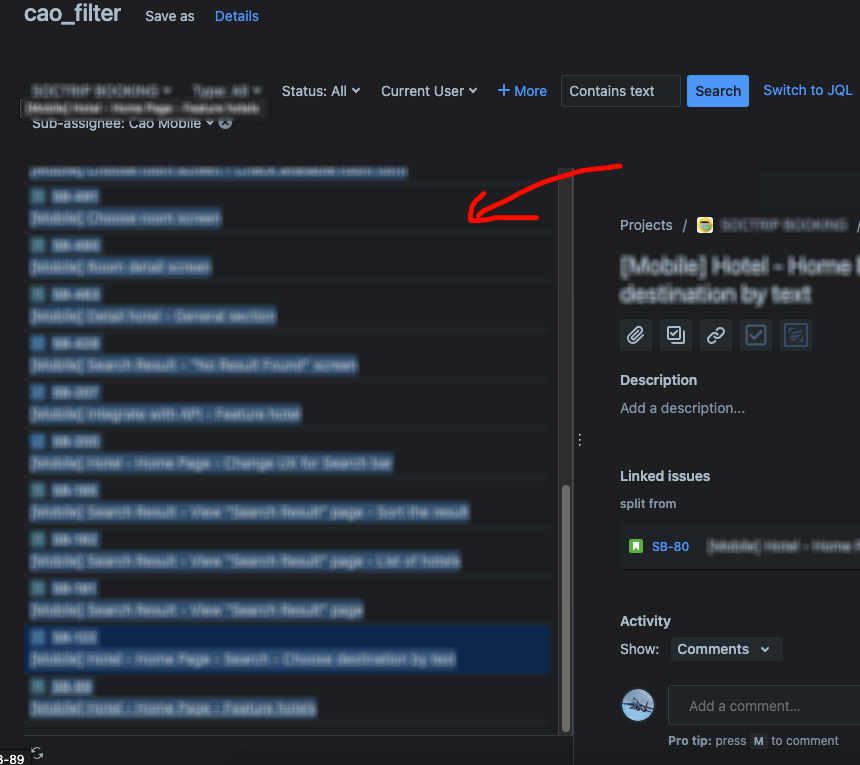
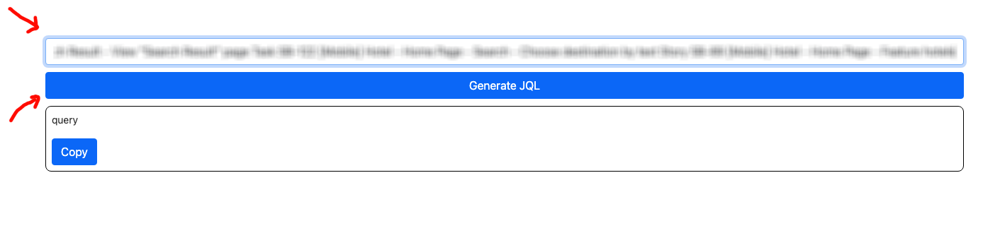
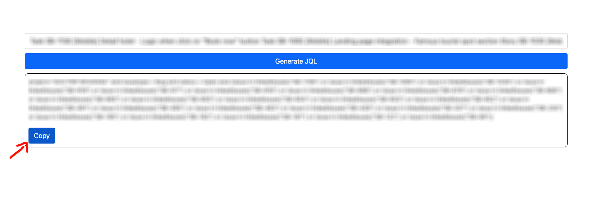
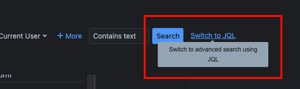
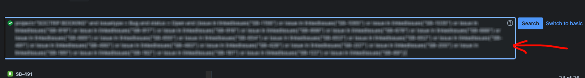

# Document

1. Select any filter and apply it to your tasks.

1. Highlight the text containing your tasks and copy (Ctrl + C).

1. Access the website https://vucaoit.github.io/ and paste that into the input field.

1. Click generate and copy the JQL query

1. Go back to the filter on Jira, and then click 'Switch to JQL'.

1. Paste it into the search field and then click search.

